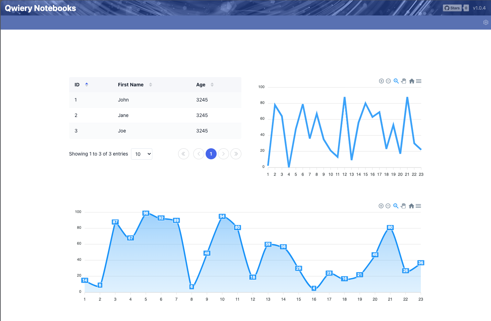
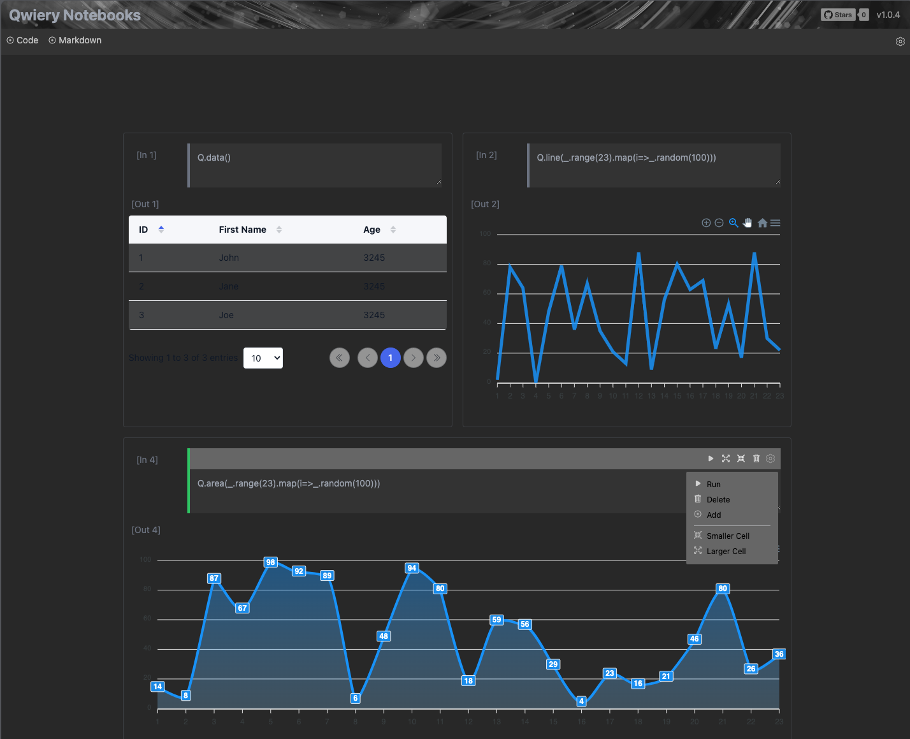

# Vue/Nuxt Literate Programming Component



This is a Vue/Nuxt component to render literate programming notebooks. It's part of the [Qwiery](https://qwiery.com) framework but you can use it independently.

To set it up you need a Vue/Nuxt app and add the following dependencies:

```text
    "@orbifold/vue-notebook":"latest",
    "@orbifold/utils": "latest",
    "@orbifold/entities": "latest",
    "@orbifold/notebook": "latest",
    "vue3-apexcharts": "^1.4.4",
    "@headlessui/vue": "^1.7.16",
    "@bhplugin/vue3-datatable": "^1.1.3"
```

You also need to [set up Tailwind separately](https://tailwindcss.com/docs/guides/vite#vue). 
 
With this in place you can use the component as follows:

```vue
<template>
  <div class="bg-blue-700 text-white text-xl">Notebook Integration</div>
  <div class="border-2 border-gray-200 p-4 m-4 w-5/12 justify-center mx-auto">
    <Notebook ref="nbv" class=""></Notebook>
  </div>
</template>
<script setup lang="ts">
  import "@orbifold/notebook/dist/style.css"
  import {onMounted, ref} from "vue";

  const nbv = ref(null);
  let nb;

  onMounted(() => {
    nb = nbv.value;
    nb.addCell();

  });
</script>
```

Note in particular that you need to import the CSS file. 

If you clone the notebook repo you can also run a demo app (screenshot above) with the usual:

```bash
npm run dev
```

## Feedback

This component is part of the [Qwiery](https://qwiery.com) framework to help jump-start your graph visualizations. It's neither bug-free nor complete and
if you find something isn't as expected you [can report it](https://github.com/Qwiery/qwiery-nuxt/issues) or contact us:

- [ X](https://twitter.com/theorbifold)
- [Email](mailto:info@qwiery.com)
- [Orbifold Consulting](https://GraphsAndNetworks.com)

## Consulting and Custom Development

You can use any of the links above to contact us with respect to custom development and beyond. We have more than 20 years experience with everything graphs.

## License

**MIT License**

_Copyright (c) 2024 Orbifold B.V._

Permission is hereby granted, free of charge, to any person obtaining a copy
of this software and associated documentation files (the "Software"), to deal
in the Software without restriction, including without limitation the rights
to use, copy, modify, merge, publish, distribute, sublicense, and/or sell
copies of the Software, and to permit persons to whom the Software is
furnished to do so, subject to the following conditions:

The above copyright notice and this permission notice shall be included in all
copies or substantial portions of the Software.

THE SOFTWARE IS PROVIDED "AS IS", WITHOUT WARRANTY OF ANY KIND, EXPRESS OR
IMPLIED, INCLUDING BUT NOT LIMITED TO THE WARRANTIES OF MERCHANTABILITY,
FITNESS FOR A PARTICULAR PURPOSE AND NONINFRINGEMENT. IN NO EVENT SHALL THE
AUTHORS OR COPYRIGHT HOLDERS BE LIABLE FOR ANY CLAIM, DAMAGES OR OTHER
LIABILITY, WHETHER IN AN ACTION OF CONTRACT, TORT OR OTHERWISE, ARISING FROM,
OUT OF OR IN CONNECTION WITH THE SOFTWARE OR THE USE OR OTHER DEALINGS IN THE
SOFTWARE.

```

```
